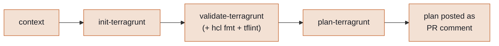
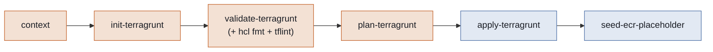

# How the infra pipeline works

One workflow, six jobs, always run in the same order. What changes is which trigger fired — a PR preview, or a real push. Triggers only when a change touches the `infra/` folder — nothing else wakes this workflow up.

Source: [`.github/workflows/infra.yml`](../.github/workflows/infra.yml)

## Diagram 1 — Pull request workflow

Opening a PR, or pushing a new commit to it, runs three checks and stops — nothing gets applied yet.

Preview only — never applies anything. None of these four jobs set a GitHub Environment; they authenticate to AWS with a repo-level role (see below), not one scoped to a specific Environment.

## Diagram 2 — Push workflow

A push to dev, qa, or main — which is what a merge actually produces — runs the identical three checks, then applies, then seeds ECR if needed.

Same three checks as the PR workflow, plus apply — which only ever happens here — plus a check that seeds any freshly-created, still-empty ECR repo with a placeholder image, so a brand-new ECS service always has something to pull.

**`apply-terragrunt`/`seed-ecr-placeholder` are the only two jobs gated by a GitHub Environment**, and only for qa/prod — dev runs both fully automatically, no gate at all. qa/prod reuse the same `qa`/`prod` Environments the backend deploy pipeline (`_deploy-core.yml`) already gates with required reviewers, rather than dedicated infra-only Environments.

## AWS authentication

Every job that needs AWS credentials uses the `terragrunt-setup` composite action ([`.github/actions/terragrunt-setup`](../.github/actions/terragrunt-setup/action.yml)) — installs Terraform + Terragrunt and assumes a role via OIDC, given a `role_arn` and `region`. `seed-ecr-placeholder` uses the plainer `ecr-login` action instead, since it only needs Docker/ECR access, not Terraform.

The role itself is picked with a chained expression on `context`'s resolved environment — `DEV_AWS_ROLE_ARN`, `QA_AWS_ROLE_ARN`, or `PROD_AWS_ROLE_ARN`, all **repo-level** variables, not GitHub-Environment-scoped ones. These are the same `deploy-dev`/`deploy-qa`/`deploy-prod` roles the backend deploy pipeline uses — one role per environment, shared across both purposes, rather than separate infra-only and backend-only roles.

## Job by job

| # | Job | What it does |
|---|-----|---------------|
| 1 | `context` | Figures out the environment — dev, qa, or prod — from the branch name. Errors out on any other branch instead of silently defaulting. |
| 2 | `init-terragrunt` | Connects to the S3 state backend — creating the bucket automatically if it doesn't exist yet — and downloads providers. Fails fast if credentials or backend access are broken. |
| 3 | `validate-terragrunt` | Checks the Terraform code is syntactically valid, then checks formatting (`hcl fmt`) and AWS best-practice rules (`tflint`) — all in one job. |
| 4 | `plan-terragrunt` | Previews exactly what would change. On a PR, posts that preview as a comment for review. |
| 5 | `apply-terragrunt` — *push only* | Actually makes the change. Automatic for dev; waits for a required reviewer on qa/prod. |
| 6 | `seed-ecr-placeholder` — *push only* | If a service's ECR repo has zero images (a fresh environment's first apply), builds and pushes a placeholder image so its ECS service has something to pull. Never touches a repo that already has a real image. |

---

thor-backend · generated from [`.github/workflows/infra.yml`](../.github/workflows/infra.yml)
