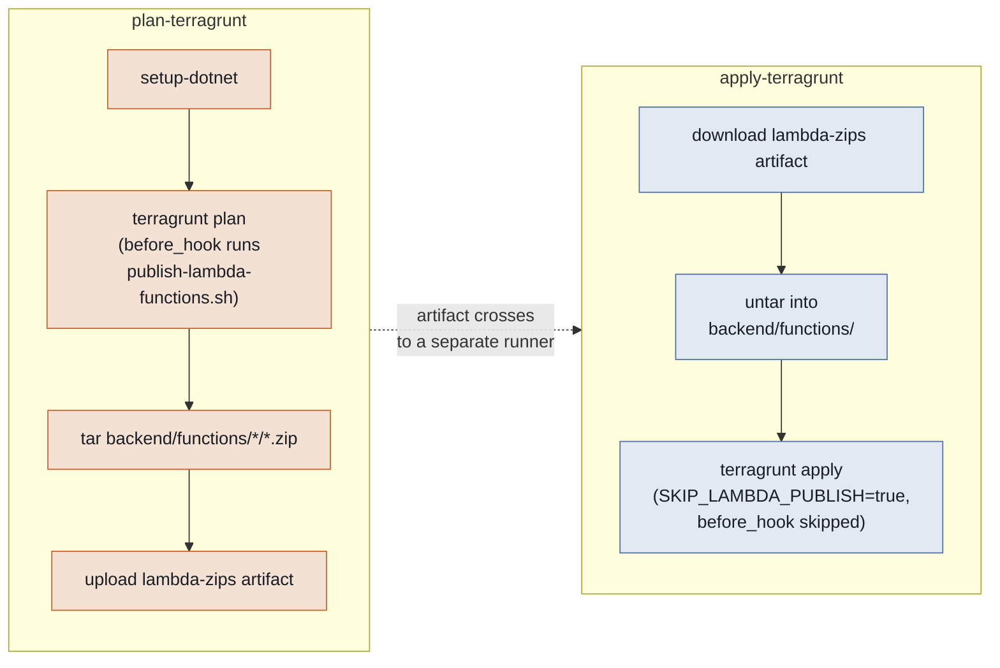

# How the Lambda build pipeline works

Terraform can zip files, but it can't compile C#. Every Lambda function
under `backend/functions/` needs to be `dotnet publish`ed into real,
deployable output *before* `terragrunt plan`/`apply` runs — otherwise
Terraform's `archive_file` data source has nothing to zip. This is what
`scripts/publish-lambda-functions.sh` exists to do, and this doc covers
how it's wired into `infra/root.hcl` and `.github/workflows/infra.yml`.

Source: [`scripts/publish-lambda-functions.sh`](../scripts/publish-lambda-functions.sh),
[`infra/root.hcl`](../infra/root.hcl), [`.github/workflows/infra.yml`](../.github/workflows/infra.yml)

## What the script does

For every `backend/functions/<Name>/src/*.csproj` it finds, generically —
no hardcoded function names, so a brand-new function under
`backend/functions/` is picked up automatically, with no script, root.hcl,
or infra.yml change needed:

1. Hashes that function's `src/` contents plus `global.json` (which pins
   the SDK version and can change compiled output).
2. Compares that hash against `.publish-hash`, a marker file written next
   to (not inside) the function's `publish/` directory — kept outside
   `publish/` deliberately, since anything inside it gets zipped straight
   into the deployed Lambda package.
3. **If the hash matches**: skips the build. This only ever helps
   locally — a CI job always starts from a fresh checkout with nothing to
   compare against, so it always rebuilds.
4. **If it doesn't match** (or nothing's been published yet): runs
   `dotnet publish <csproj> -c Release -o <function>/publish`, then
   records the new hash.

Each function's `publish/` directory is exactly what `terraform_source_dir`
points a lambda module at — `dotnet publish`'s deployable output, not
`dotnet build`'s `bin`/`obj` (which are pure build-tool artifacts,
gitignored, and irrelevant to what gets zipped and deployed).

## How `root.hcl` wires it in

```hcl
terraform {
  before_hook "publish_lambda_functions" {
    commands     = ["plan", "apply", "destroy"]
    execute      = ["${get_repo_root()}/scripts/publish-lambda-functions.sh"]
    run_on_error = false
    if           = get_env("SKIP_LAMBDA_PUBLISH", "false") != "true"
  }
}
```

- **Runs before `plan`, `apply`, and `destroy`** — `destroy` needs it too,
  since Terraform still has to evaluate the full resource graph
  (including `archive_file`) to plan a destroy, even though nothing new
  actually gets deployed.
- **`get_repo_root()`, not `path.module`** — Terragrunt only copies
  `infra/src` into its ephemeral working directory, never `backend/`, so
  the script has to be reached by an absolute, repo-root-relative path.
  Same reasoning applies to each lambda module's own `*_source_dir`
  variable in every environment's `terragrunt.hcl`.
- **`if = get_env("SKIP_LAMBDA_PUBLISH", "false") != "true"`** — the hook
  is skippable via an env var, which is exactly what `infra.yml`'s
  `apply-terragrunt` job does (see below).

## How `infra.yml` uses it



`plan-terragrunt` and `apply-terragrunt` run on **separate GitHub Actions
runners** — nothing built by one is visible to the other by default. That
matters here because `terraform apply <planfile>` does not re-invoke
`archive_file`'s `Read` (confirmed via a real, reproduced CI failure): the
zip that `plan-terragrunt` built has to physically travel to
`apply-terragrunt`'s runner, or the apply fails looking for a file that
was never written there.

- **`plan-terragrunt`**: runs `actions/setup-dotnet` first (the
  `before_hook` needs a real SDK on `PATH`), then `terragrunt plan` — which
  triggers `publish-lambda-functions.sh` for real. Any resulting
  `backend/functions/*/*.zip` files get `tar`'d into one opaque
  `/tmp/lambda-zips.tar.gz` and uploaded as an artifact (`tar`, not
  `actions/upload-artifact`'s own directory handling, because that action's
  path-prefix preservation depends on how many files match the glob — with
  exactly one Lambda function, it silently dropped the folder structure;
  confirmed by testing, not assumed). `if-no-files-found: ignore` — no
  zips exist when `enable_authorizer` is off for that environment, which
  is fine.
- **`apply-terragrunt`**: downloads and untars that same archive back into
  `backend/functions/`, then applies. Its job-level
  `SKIP_LAMBDA_PUBLISH: "true"` env var makes `root.hcl`'s `before_hook`
  skip entirely — this job doesn't even install the .NET SDK — because it
  already has the exact zip `plan-terragrunt` built and reviewing a saved
  plan against freshly-rebuilt code would defeat the point of applying
  *the plan that was reviewed*.

## Why this exists at all

Without it, `terraform apply` would either fail outright (`archive_file`
"could not archive missing directory" — nothing had ever compiled the
function) or, worse, silently zip stale/placeholder output. The whole
chain — script → `before_hook` → `setup-dotnet` → tar/untar artifact
crossing — exists to make sure every `apply` deploys whatever's actually
in `backend/functions/<Name>/src/` at that commit, with no manual build
step for anyone touching this repo.

---

thor-backend
