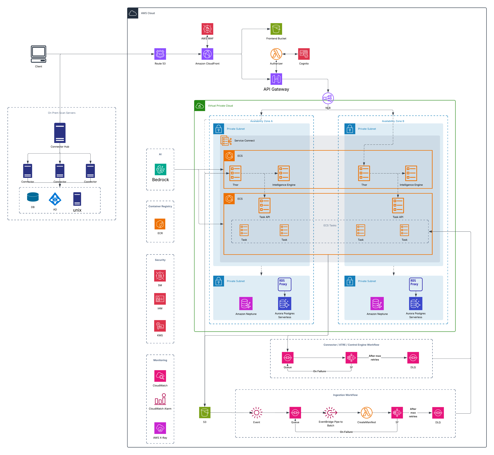

# Thor Architecture

> **Status:** Living document. Each subsection records a decision and its rationale.
> Items under **Open Questions** still need a call before they are locked.
> The companion diagram is `thor_architecture.png`; where the diagram is
> ambiguous, this text is authoritative (see §6.1 on reading the data-layer AZs).

## 1. Overview

Thor is a **multi-tenant Identity Hygiene SaaS platform**, cloud-native and
deployed on AWS. It ingests identity data from customer environments (on-prem
and cloud), detects what has changed via Change Data Capture, and runs business
workflows to identify accounts, violations, and hygiene issues.

Core design principles:

1. **Tenant isolation by default** — every data path must resolve tenant from a
   *trusted* source and must fail closed if the tenant cannot be verified.
2. **Never trust spoofable input** — subdomains, headers, file paths, and API
   keys are only ever *hints*; the authoritative binding always comes from the
   tenant metadata store or a cryptographically verified token.
3. **Consistent, composable workflows** — every business process is an
   independent module built to a common pattern so new processes are additive.
4. **Elastic path from single-cluster to cluster-pool** — the platform starts on
   one shared data cluster and scales to many clusters by data (routing), not by
   re-architecture.

### Architecture Diagram



> See §6.1 for how to read the data layer: Aurora and Neptune are each drawn in
> both AZs to show one cluster's instances spanning AZs for HA — not a cluster
> per AZ.

## 2. Tech Stack

- **Frontend:** Vue (latest) + TypeScript + Vite. Static SPA served from S3 via
  CloudFront.
- **Backend:**
  - **Thor API** (internet-facing API layer): C# / .NET 10.
  - **Task API** (internal task/workflow control API): C# / .NET 10.
  - **Workflow Tasks** (compute for business processes): C# / .NET 10.
  - **Intelligence Engine** (AI): Python + LangChain + AWS Bedrock.
- **Infrastructure:** Terraform.

## 3. This Repository

This is a **mono-repo** containing all **backend** and **infrastructure** code.
It does **not** contain connector code or frontend code (those live in their own
repos).

## 4. Networking & Edge

Ingress path for user/API traffic:

```
Client → Route 53 → CloudFront (+ WAF) → API Gateway → VPC Link → NLB → Thor API (ECS)
```

- **Thor API is the only internet-facing service.** All other services are
  private and are only reachable by Thor API (or by internal orchestration).
- **Per-tenant subdomains** (`<tenant>.thor.example.com`) resolve via Route 53 to
  a single CloudFront distribution using a **wildcard certificate**
  (`*.thor.example.com`) and wildcard alternate domain name.
- **WAF is attached at CloudFront** (edge). Managed rule groups + rate-based
  rules; see §9 for per-tenant throttling.
- **API Gateway reaches Thor API through a VPC Link → private NLB.** There is no
  ALB: all traffic terminates at the single Thor API service, so L7 host/path
  routing (the reason to use an ALB) is unnecessary. API Gateway already handles
  routing and authorization, and WAF is at CloudFront, so an NLB (L4) is the
  right, cheaper fit. The NLB stays in a private subnet.
- **API Gateway is a deliberate choice** (not a redundant hop): it lets us wire
  authentication at the edge — a **Cognito authorizer** for user traffic and a
  **Lambda authorizer** for API-key (connector) traffic — so unauthenticated
  requests never reach the NLB or Thor API. See §5.

**Frontend** is served as static assets from a private S3 bucket via a
CloudFront origin (OAC), separate from the API origin.

### 4.1 Connector data-plane path

On-prem and cloud connectors do **not** stream file bytes through the API. They:

1. Authenticate to **Thor API** (API-key path, §5.1) and request a presigned
   S3 URL.
2. Upload file bytes **directly to S3** using the presigned URL.

Consequences:
- The upload data-plane **bypasses CloudFront/WAF/API Gateway** by design. The
  compensating controls are: presigned URLs are short-lived, prefix-scoped, and
  size/content-type constrained (§5.2); the bucket enforces TLS-only and blocks
  public access; uploaded objects are treated as untrusted until validated.

## 5. Authentication, Authorization & Tenant Resolution

### 5.1 Identities & edge authorization

Authentication is enforced at **API Gateway (REST API)** so unauthenticated
traffic never reaches the NLB or Thor API:

- **Users** authenticate via **Amazon Cognito** (one user pool per tenant; local
  users and/or the tenant's federated SAML/OIDC IdPs). The resulting JWT carries a
  verified tenant claim.
- **Connectors / external services** authenticate with an **API key**, validated
  by a **Lambda authorizer** (REST API, `REQUEST` type) that resolves the
  candidate tenant from the subdomain and verifies the hashed key against the
  **Master metadata DB** (§5.2) before the request is forwarded.

> **Decision — Cognito M2M rejected.** Cognito `client_credentials` (M2M) was
> evaluated as the connector credential and rejected because (a) it requires a
> **publicly reachable `/oauth2/token` endpoint**, which is not acceptable here,
> and (b) **per-token-request billing** ($2.25 per 1,000 successful token
> requests) is an ongoing cost that scales with connector traffic and depends on
> every connector caching tokens correctly. Static, hashed API keys have neither
> drawback and keep full control of scoping/revocation in our data plane.

### 5.2 API key handling (decision)

- **Keys live in the Master metadata DB, not the tenant DB.** The authorizer
  already resolves `subdomain → tenant` from the Master DB on every request, so
  keeping keys there makes authentication a **single lookup** and keeps tenant
  databases entirely off the hot auth path — no per-tenant RDS Proxy connection is
  opened just to check a key (avoids the connection pressure of §6.3). An API key
  is platform/edge auth material, colocated with tenant + routing metadata.
- Keys are **stored as salted hashes** — never plaintext or reversible. Format is
  `thor_{keyId}_{secret}`: `keyId` indexes the row; `secret` is verified as
  **`HMAC-SHA256(pepper, salt ‖ secret)`** with a per-key random salt and a global
  **pepper held in Secrets Manager** (§8). Comparison is constant-time. The raw
  key is shown to the customer exactly once at creation.
- Each key row carries: tenant binding, scopes, expiry, revocation, and last-used
  timestamp, and is independently revocable.
- **Tenant resolution for a key:** the subdomain gives a *candidate* tenant; the
  candidate resolves the tenant in the Master DB, and the presented key is looked
  up by `keyId`. The request proceeds only if the key's stored tenant binding
  matches the subdomain-derived candidate. Any mismatch fails closed and emits a
  security event (§10). Subdomain alone is never sufficient.
- **Create/revoke API (Thor API):** a tenant-scoped API issues keys (generate
  secret, store salt + HMAC, return raw key once) and revokes them (set
  `revokedAt`). Same hashing code path (`Thor.Auth`) is shared by issuance and
  verification.

### 5.3 Presigned URL scoping (decision — tenant isolation boundary)

Presigned URLs are the **primary isolation boundary for uploads**, so URL
generation is treated as security-critical:

- The S3 key **prefix is hard-bound to the authenticated tenant**
  (`tenants/<tenantId>/uploads/...`); the caller cannot influence the tenant
  segment.
- URLs are short-lived, single-object, and constrain `content-length-range` and
  `content-type`.
- On ingestion, tenant is read back from the object key prefix and
  **re-verified** against the tenant metadata store before any processing.

### 5.4 Tenant resolution rules (authoritative)

| Entry point | Candidate source | Authoritative verification |
|-------------|------------------|----------------------------|
| User API request | JWT tenant claim | Cognito-verified token; cross-checked to subdomain |
| Connector API request | Subdomain | Hashed API key in Master DB; stored tenant binding cross-checked to subdomain |
| S3 upload / ingestion | Object key prefix | Re-verified against tenant metadata store |

**Rule:** the candidate source only *narrows* the lookup; the request/job is
authorized only after the authoritative source confirms the same tenant. Any
mismatch fails closed and emits a security event (§10).

## 6. Data Layer

### 6.1 Stores (decision)

- **Amazon Aurora PostgreSQL Serverless v2** is the primary relational store.
- **Amazon Neptune** is the graph store, deployed as a **single regional,
  multi-AZ, tenant-partitioned** cluster following the
  [Neptune multi-tenant partition strategy](https://aws.amazon.com/blogs/database/build-multi-tenant-architectures-on-amazon-neptune/).
- Aurora and Neptune are each **one cluster with instances spread across AZs**,
  **not** per-AZ deployments.
  > **Reading the diagram:** `thor_architecture.png` draws Aurora and Neptune in
  > each AZ to show that instances of the *same* cluster run in both AZs for high
  > availability. It is **one Aurora cluster** (writer + reader spanning AZs) and
  > **one Neptune cluster**, not a cluster per AZ.
- **Read models** materialize expensive joins; **materialized views** answer
  analytical queries.

### 6.2 Tenancy model (decision)

- **Database-per-tenant** on a **shared Aurora cluster** to start.
- A **Master metadata DB** stores tenant metadata and **routing details**.
- **Routing resolves to `{ clusterEndpoint, databaseName, dbUser, secretRef }`,
  not just a database name.** This is the key to scaling: when a cluster shows
  contention we add another cluster and move tenants by updating routing rows —
  no application change.
- **DB users:** one read/write DB user per tenant **and** one read-only DB user
  per tenant for the Intelligence Engine. Credentials live in **Secrets
  Manager** (§8).

Scaling posture: **start with one cluster, add clusters as contention/size
grows.** The cluster-pool is expressed entirely in the routing table.

### 6.3 Connection management (decision)

Access is always through **RDS Proxy** to bound backend connections and survive
failovers.

Multi-tenant connection flow:

```
                        +----------------------+
                        |      API Request     |
                        +----------+-----------+
                                   |
                   Authenticate & authorize (§5)
                        Resolve verified tenant
                          (JWT / API key / SSO)
                                   |
                                   v
                     +----------------------------+
                     |    Tenant Metadata Store   |
                     |----------------------------|
                     | TenantId                   |
                     | ClusterEndpoint            |
                     | DatabaseName               |
                     | DatabaseUser               |
                     | SecretRef / IAM Auth       |
                     +-------------+--------------+
                                   |
                                   v
                     +-----------------------------+
                     | Tenant Connection Manager   |
                     +-----------------------------+
                                   |
                       Look up / create tenant pool
                       (keyed by cluster + db + user)
                                   |
        --------------------------------------------------
        |                          |                     |
        v                          v                     v
+---------------+          +---------------+     +---------------+
| Pool Tenant A |          | Pool Tenant B |     | Pool Tenant C |
+-------+-------+          +-------+-------+     +-------+-------+
        |                          |                     |
        +--------------------------+---------------------+
                                   |
                            Borrow connection
                                   |
                                   v
                    +-----------------------------+
                    | Connection Interceptor      |
                    +-----------------------------+
                                   |
                        Execute validation query
              (assert current_database() == expected)
                                   |
                +------------------+------------------+
                |                                     |
              Success                             Mismatch
                |                                     |
                v                                     v
     Create session / DbContext            Close connection
                |                           Evict from pool
                |                           Log SECURITY event (§10)
                |                           Fail request (fail closed)
                v
         Business logic
                |
         Commit / rollback
                |
         Return connection to pool
```

**Connection-scale note:** database-per-tenant × many ECS tasks × per-tenant
pools multiplies connections, and RDS Proxy pools per `(db, user)` pair — the
per-tenant DB user fragments proxy reuse. Mitigations: keep per-task pools small,
prefer short-lived borrow, and treat "connections per cluster" as a primary
signal for splitting to a new cluster (§6.2). See **O-3**.

### 6.4 Schema changes (decision)

Schema changes use a
[Blue/Green deployment strategy](https://docs.aws.amazon.com/whitepapers/latest/blue-green-deployments/best-practices-for-managing-data-synchronization-and-schema-changes.html)
to manage data synchronization and cut-over safely across the tenant fleet.

## 7. Compute & Orchestration

- **ECS Fargate** is the primary compute engine; **Lambda** is used for short
  tasks, ECS Fargate for long-running tasks.
- **AWS Batch** is used for large, parallelizable ingestion fan-out (manifest →
  array jobs). *(Present in the diagram; recorded here so ADR and diagram agree.)*
- **Orchestration:** every workflow uses **Step Functions** as the orchestrator
  with Lambda/ECS/Batch for compute, in a consistent module pattern.
- **Intelligence Engine** runs on ECS (Python/LangChain) and calls Bedrock.

## 8. Secrets & Encryption

- **Secrets Manager** stores all DB credentials (per-tenant RW user, per-tenant
  read-only AI user) and API-key-signing material.
- **Secret rotation (decision):** rotation is automated via Secrets Manager
  rotation Lambdas. Because there are N tenant secrets, rotation is staggered and
  driven off the tenant routing table so it scales with cluster count. See **O-4**.
- **KMS (decision):** all data at rest (Aurora, Neptune, S3, backups, SQS) is
  encrypted with KMS. **Per-tenant CMKs** are used where tenant-level key
  isolation / crypto-shred-on-offboarding is required (§11). BYOK is an
  evaluated option - see **O-5**.

## 9. Multi-tenant Fairness (decision)

Shared SQS + ECS + cluster means one tenant can starve others ("noisy
neighbor"). Controls:

- **Per-tenant throttling** at the edge (WAF rate rules keyed by tenant) and at
  Thor API (token-bucket per tenant).
- **Ingestion fairness:** work is partitioned per tenant so one tenant's large
  scan cannot monopolize workers; concurrency caps per tenant on Step
  Functions / Batch.
- **Backpressure & poison handling:** bounded queues, visibility-timeout tuning,
  DLQ with alarms, and idempotent consumers (§12).

## 10. Observability & Audit

- **Operational telemetry:** CloudWatch (logs/metrics), CloudWatch Alarms, and
  AWS X-Ray (tracing).
- **Audit log (decision — new):** a **tamper-evident, append-only audit store**
  records security- and tenant-relevant events (auth outcomes, tenant-resolution
  mismatches, key create/revoke, data access by the AI user, workflow outcomes,
  violation determinations). This is a first-class product concern for an
  identity-hygiene platform and is **separate from ops logs**. Audit events are
  tenant-scoped and retained per contractual/compliance requirements. See **O-6**
  for store choice (e.g., dedicated Aurora schema vs. append-only log service).

## 11. Tenant Lifecycle (decision — new)

- **Onboarding is a manual, runbook-driven process for now** (see
  [`tenant_onboarding.md`](./tenant_onboarding.md)): create tenant DB on the
  target cluster, create RW + read-only DB users, store secrets, create Neptune
  partition, seed routing row, provision Cognito/IdP config. The runbook is
  written to be **automation-ready** (idempotent, ordered steps) so it can later
  be lifted into a Step Functions workflow without redesign.
- **Offboarding / data purge:** a governed workflow purges tenant data across
  **Aurora, Neptune, S3, and backups**, honoring **GDPR/erasure** obligations.
  Where per-tenant CMKs are used (§8), crypto-shredding the key is the primary
  erasure mechanism, with backups aging out under retention policy. See **O-7**.

## 12. Ingestion & CDC

CDC is the heart of the product. Per scan, the platform receives *n* files that
are ingested into **staging tables**, then compared against **canonical tables**
to propagate only what changed to downstream workflows.

Ingestion workflow (per diagram):

```
S3 (upload) → S3 Event → SQS → EventBridge Pipe → AWS Batch (CreateManifest / process)
            → Step Functions → (after max retries) → DLQ
```

CDC decisions:

- **Comparison is set-based, not row-by-row:** staged rows are hashed and diffed
  against canonical hashes in bulk (join on natural key), producing
  insert/update/delete sets.
- **Deletes are detected explicitly:** canonical keys absent from the current
  scan set are emitted as deletes (with a full-vs-partial scan flag so partial
  scans don't mass-delete).
- **Hash definition is explicit and versioned:** the hash covers a defined,
  ordered column set with a named algorithm (e.g., SHA-256) and a `hashVersion`
  so hash-definition changes are safe.
- **Idempotency:** every ingestion job carries an idempotency key
  (`tenant + scanId + fileId`) so DLQ redrive / retries never double-apply.
- **Ordering:** per-tenant / per-scan ordering is preserved where required
  (FIFO grouping by tenant/scan, or a scan-level sequencing guard). See **O-8**.

## 13. Intelligence Engine Data Privacy (decision — new)

- Bedrock is reached via a **VPC endpoint (PrivateLink)** so inference traffic
  stays on the AWS network and off the public internet.
- The Engine uses the **per-tenant read-only DB user** and may only read data for
  the resolved tenant.
- **PII minimization / redaction** is applied before prompts leave the VPC
  boundary; identity data sent to Bedrock is minimized to what the task needs.
- **Prompt-injection handling** and **region pinning** (data residency) are
  explicit requirements. See **O-9**.

## 14. Resilience & DR (decision — new)

- **Multi-AZ** for Aurora, Neptune, and ECS services.
- **Backups / PITR** enabled on Aurora and Neptune; S3 versioning +
  lifecycle on data buckets.
- **RPO/RTO and cross-region strategy** must be stated per environment. See
  **O-10**.

## 15. Environments & Delivery

- Separate **dev / staging / prod** environments via Terraform workspaces/modules.
- CI/CD, image scanning (ECR), and infra plan/apply gating. See **O-11**.

## 16. Workflows

Workflows are the business processes that ingest data and identify accounts,
violations, etc. Each workflow is an **independent module** that can also be a
stage in a larger pipeline. Every module follows the same pattern (queue →
orchestrator → compute → DLQ, idempotent, tenant-scoped) so new business
processes are additive.

---

## Open Questions

| ID | Question |
|----|----------|
| O-3 | Target **tenant count / connections-per-cluster** threshold that triggers adding a new cluster? |
| O-4 | Secret **rotation cadence** and whether rotation is zero-downtime for per-tenant users. |
| O-5 | Do we need **per-tenant CMKs / BYOK**, or is a shared KMS key acceptable for v1? |
| O-6 | **Audit store** choice, schema, and retention requirements. |
| O-7 | **Data-purge SLA** and legal/erasure requirements (GDPR, contractual). |
| O-8 | Is strict **per-tenant/per-scan ordering** required, or is idempotent out-of-order processing acceptable? |
| O-9 | Bedrock **data-residency/region** constraints and PII-redaction requirements. |
| O-10 | Target **RPO/RTO** and whether **cross-region DR** is in scope. |
| O-11 | **CI/CD** and environment-promotion strategy. |

## Changelog

- Auth: connectors authenticate with **hashed API keys stored in the Master
  metadata DB** (moved from tenant DB), verified by a REST-API Lambda authorizer.
  Cognito M2M was evaluated and rejected (public token endpoint + per-token cost).
  Key format `thor_{keyId}_{secret}`, HMAC-SHA256 with a Secrets Manager pepper.
- Restructured into decision-oriented sections; fixed typos.
- Reconciled diagram vs. text (Aurora/Neptune single-cluster, AWS Batch, VPC Link).
- Made cluster routing (not just DB name) the scaling primitive.
- Added decisions: API-key hashing, presigned-URL scoping, audit log, tenant
  lifecycle/purge, CDC deletes/idempotency/ordering, Bedrock privacy, secret
  rotation, KMS/CMK, multi-tenant fairness, DR, environments.
